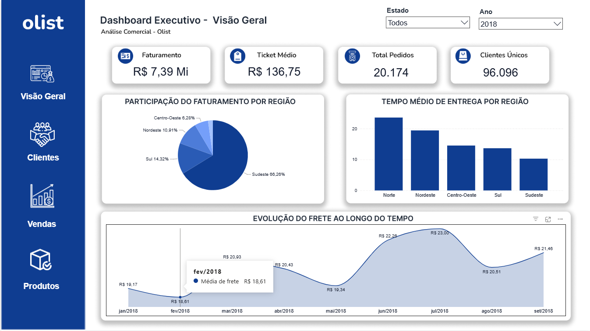
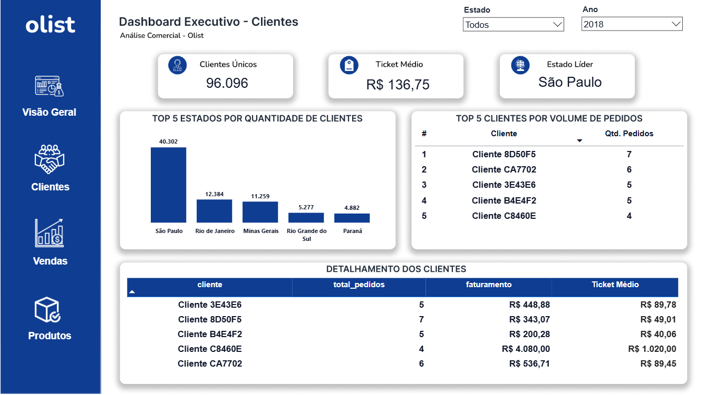
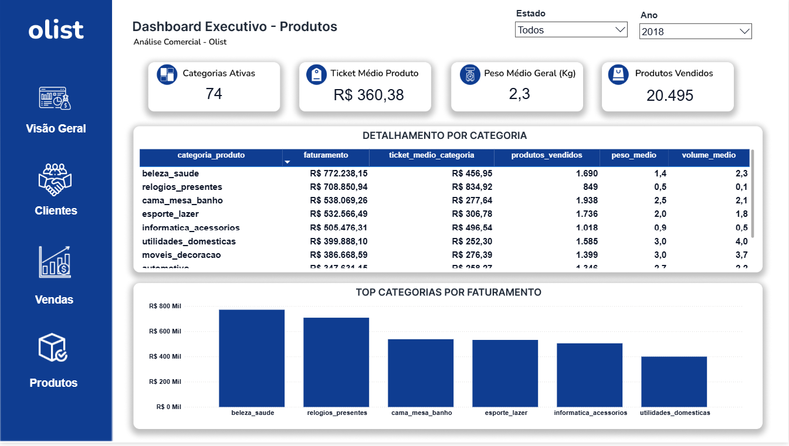
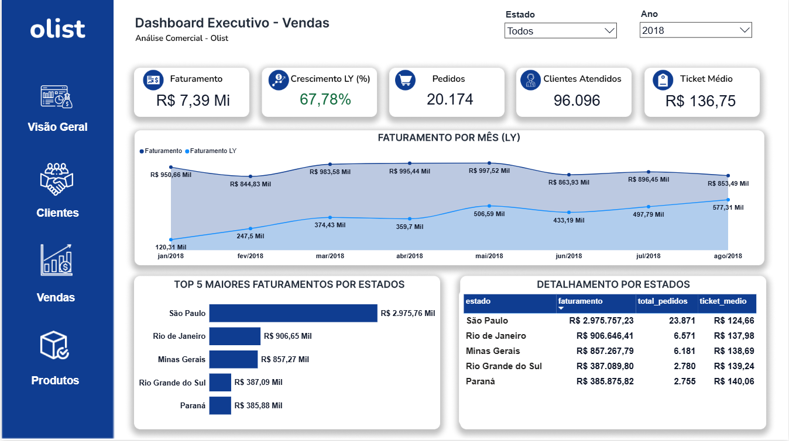

# Dashboard de Vendas | Power BI + Databricks

## Sobre o projeto

Este projeto consiste no desenvolvimento de um dashboard interativo para análise de vendas de um e-commerce, com o objetivo de transformar dados em informações estratégicas para apoiar a tomada de decisão.

Os dados passaram por uma etapa de preparação no Databricks para garantir maior qualidade das informações e, posteriormente, foram modelados e analisados no Power BI. O dashboard reúne indicadores de desempenho relacionados a vendas, clientes, produtos e logística, permitindo acompanhar a evolução do negócio sob diferentes perspectivas.

## Tecnologias utilizadas

* Power BI
* DAX
* Databricks
* Figma

## Competências demonstradas

* Análise exploratória de dados (EDA)
* Tratamento e preparação de dados
* Modelagem de dados
* Desenvolvimento de dashboards interativos
* Criação de medidas e indicadores com DAX
* Visualização de dados
* Geração de insights para apoio à tomada de decisão

##  Dashboard

Abaixo estão as principais páginas desenvolvidas durante o projeto.

## Visão Geral

## Clientes

## Produtos

## Vendas

